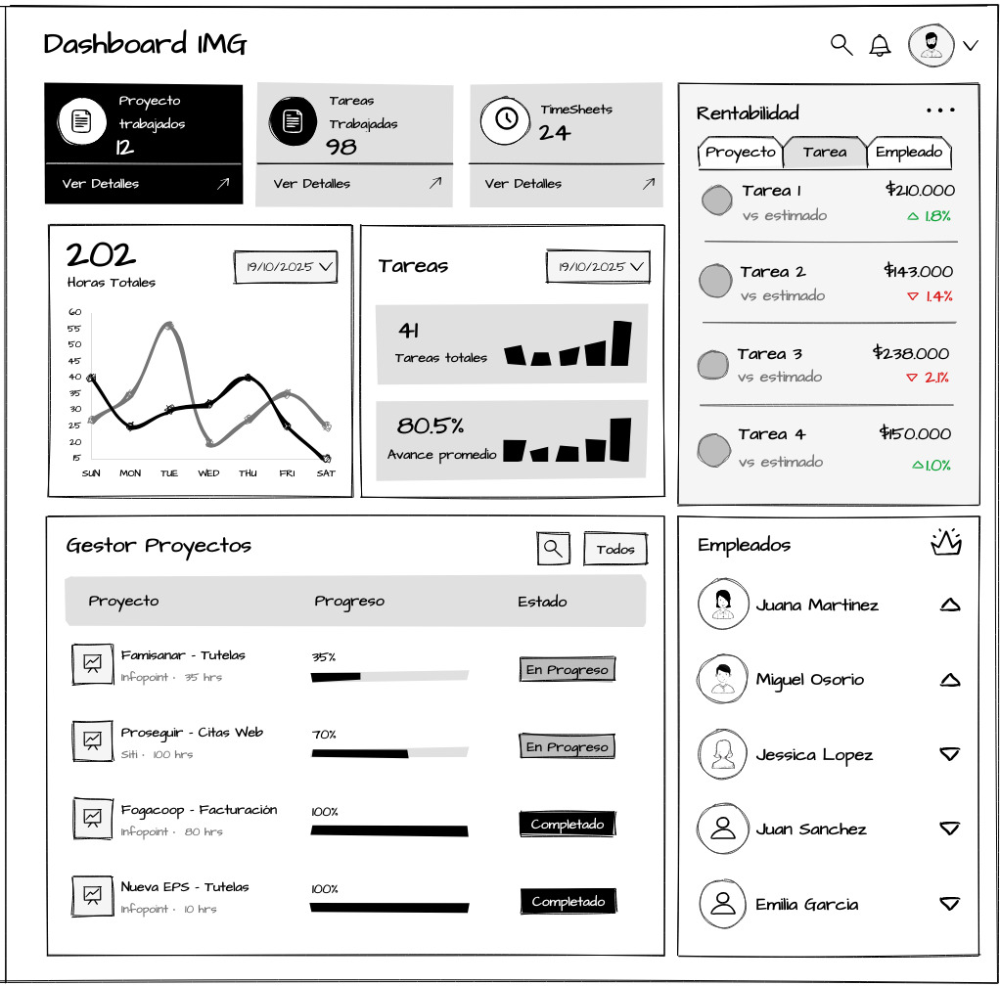
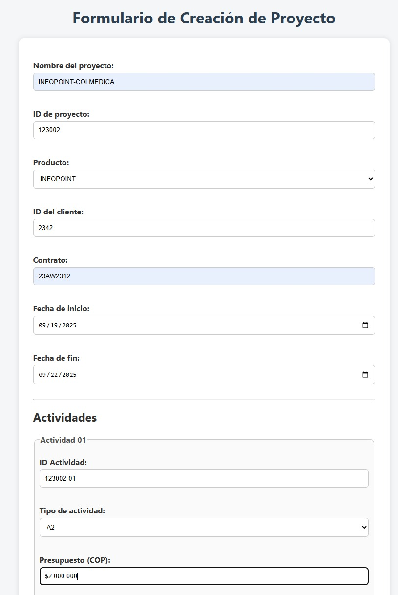

# Integrantes:
- 202512491 Ivan Suarez
- 202525657 Diego Baron
- 123 Santiago Palacios
- 202525326 Miguel Benavides

# Instalaciones
Para ejecutar el notebook proyecto_final.ipynb se debe ejecutar en consola cmd el comando ".\setup.bat", con el fin de instalar ambiente virtual y librerías necesarias para la ejecución del notebook. Finalmente, se debe seleccionar el kernel **venv** para ejecutar las celdas de código.

# Proyecto Ciencia de Datos
El propósito de este proyecto es aplicar el conjunto de técnicas y herramientas vistas durante el semestre para desarrollar un proyecto de ciencia de datos en una organización.

Con la intención de realizar una entrega de acuerdo a lo propuesto en el enunciado del proyecto académico, parte del contenido se desarrollará en el presente README. El PDF entregable solo es un resumen ejecutivo con la información más relevante. 

---

# Entrega 1

## 1. Problematica y Negocio.

 

La empresa analizada es IMG Procesos y Tecnología, ubicada en Bogotá, Colombia, con más de 15 años de experiencia en el desarrollo de soluciones orientadas a la centralización, gestión y disponibilidad de la información para sus clientes. 

Su foco está en la implementación de soluciones de software que mejoren la productividad, la trazabilidad y la toma de decisiones. Actualmente, los colaboradores (especialmente los desarrolladores)  deben diligenciar un formato para registrar las actividades de los proyectos en los que participan. Esta práctica fragmentada impide la consolidación de la información en un repositorio centralizado, dificultando el seguimiento oportuno, la trazabilidad de las tareas y la medición real de la productividad.
 

El principal problema radica en esta falta de integración con el repositorio centralizado, lo que impide contar con un sistema eficiente de time & activity tracking, el cual a su vez limita la visibilidad sobre la gestión de los empleados y restringe la capacidad de análisis y optimización de los procesos internos de la compañía. 

Como consecuencia directa, la organización enfrenta limitaciones significativas en la gestión de sus proyectos y del talento humano. En primer lugar, la falta de un control preciso entre los costos reales y los costos planificados dificulta la toma de decisiones presupuestales y la evaluación de la rentabilidad de los proyectos. En segundo lugar, la ausencia de datos consolidados impide un análisis objetivo del desempeño de los colaboradores, ya que no se cuenta con información confiable sobre el tiempo invertido, las tareas ejecutadas o los niveles de productividad individual y colectiva. 

Por último, la falta de integración de la información en un repositorio centralizado limita el acceso a métricas clave de desempeño en tiempo real, como el avance porcentual de los proyectos, la eficiencia operativa o el grado de cumplimiento de los objetivos. Esta situación afecta de manera directa la capacidad de la empresa para realizar un seguimiento continuo, anticiparse a desviaciones y aplicar estrategias correctivas de forma oportuna. 

**Objetivo General**

 Diseñar e implementar una solución integral de registro, integración y análisis de datos que permita optimizar la trazabilidad, productividad y gestión de los proyectos en IMG Procesos y Tecnología, facilitando la toma de decisiones basadas en información confiable y en tiempo real.

**Objetivos Especificos**

- Centralizar la información de registro de actividades de los empleados en un repositorio único y estructurado.
- Automatizar y estandarizar el proceso de captura de datos mediante una API transaccional y una interfaz de usuario intuitiva.
- Desarrollar un dashboard analítico que integre métricas de desempeño de proyectos, costos y productividad del talento humano.
- Mejorar la visibilidad y control sobre la ejecución de proyectos mediante indicadores.
- Fortalecer la toma de decisiones estratégicas basadas en evidencia, mediante reportes e indicadores.

**Definición de KPIs**

| KPI | Descripción | Fórmula / Método | Propósito |
|---|---|---:|---|
| **Porcentaje de proyectos en riesgo** | Mide la proporción de proyectos que presentan desviaciones superiores al 20% en tiempo o costo. | `(Proyectos con desviación > 20% / Total proyectos) × 100` | Detectar proyectos críticos y anticipar acciones correctivas.|
| **Cumplimiento horas proyectos (%)** | Compara las horas reales con las horas presupuestadas en proyectos. | `(Horas planificadas / Horas reales) × 100` | Controlar sobrecostos y rentabilidad de proyectos.|
| **Cumplimiento horas tareas (%)** | Horas reales vs. horas presupuestadas por tarea. | `(Horas planificadas / Horas reales) × 100` | Controlar sobrecostos y rentabilidad de tareas. |
| **Porcentaje de avance promedio por proyecto** | Progreso reportado sobre tareas planificadas. | `(Tareas completadas / Tareas totales) × 100` | Medir avance general y la adherencia al plan. |
| **Productividad promedio por empleado (horas/tarea)** | Mide el tiempo promedio que tarda cada colaborador en completar una tarea . | `Total horas registradas / Total tareas completadas` | Comparar desempeño y detectar cuellos de botella. |

## 2. Ideación

Para dar respuesta a la problemática identificada, se propone el diseño e implementación de una solución integral basada en datos, orientada a optimizar la trazabilidad, el control y la toma de decisiones sobre la gestión de proyectos y del talento humano. La iniciativa contempla el desarrollo de tres productos de datos interconectados que permitan transformar la información operativa dispersa en conocimiento estratégico y accionable.

<strong>Integración de datos (ETL)</strong>:  El primer paso consiste en centralizar toda la información proveniente de los formularios de registro de actividades de los empleados en un repositorio unificado. Esta integración permitirá eliminar la dependencia de canales informales como el correo electrónico y garantizar la disponibilidad, consistencia y trazabilidad de los datos. De esta manera, la empresa contará con una fuente única de información confiable que facilite los análisis transversales por proyecto, área o colaborador
 
 

<strong>API de registro de actividades</strong>: El segundo componente corresponde al desarrollo de una API transaccional, acompañada de una interfaz gráfica amigable, que reemplace los formatos manuales actuales. A través de esta herramienta, los empleados podrán registrar sus actividades en tiempo real, asignarlas a proyectos específicos y enviar automáticamente la información al repositorio de datos. Este flujo digitalizado reducirá errores humanos, estandarizará los procesos de captura y habilitará un ecosistema de datos más accesible, escalable y gobernable.

 

<strong>Dashboard de gestión y desempeño</strong>: Finalmente, se propone la creación de un tablero interactivo de control y seguimiento, orientado a la analítica de proyectos y productividad. Este dashboard permitirá visualizar los costos planificados versus los reales, el avance de tareas por empleado o equipo, y los principales indicadores de rendimiento, eficiencia y cumplimiento de objetivos. El tablero consolidará métricas a distintos niveles de agregación (diario, semanal, quincenal y mensual), facilitando el monitoreo de tendencias y la toma de decisiones basadas en evidencias.

A continuación, se presenta los requerimientos funcionales y no funcionales para cada uno de los productos de datos:

### ETL (Integración de Datos)

**Requerimientos funcionales**
- **Centralización de datos:** La ETL debe integrar en un único repositorio toda la información proveniente de los formularios de registro de actividades de los empleados, sin importar su origen 
- **Estandarización de formatos:** El sistema debe transformar los datos heterogéneos en un formato uniforme y estructurado
- **Validación de calidad de datos:** La ETL debe incluir reglas automáticas de validación que detecten registros incompletos, duplicados
- **Control de trazabilidad:** Se debe registrar metadatos de cada carga (fecha de extracción, origen de los datos, usuario responsable, número de registros) para asegurar la trazabilidad completa del flujo.
- **Actualización programada y/o incremental:** La ETL debe ejecutar cargas incrementales permitiendo la actualización para evitar reprocesar la totalidad del histórico cada vez.
- **Integración con repositorio centralizado:** La salida del proceso ETL debe almacenarse en un data warehouse o data lake corporativo, donde los analistas puedan consultar información unificada por proyecto, colaborador o periodo.

**Requerimientos no funcionales**
- **Calidad e integridad:** Los datos cargados al repositorio deben ser completos, consistentes y sin duplicados, asegurando la confiabilidad de los análisis y reportes.
- **Disponibilidad:** La plataforma de integración debe garantizar una disponibilidad mínima del 99.5%
- **Escalabilidad:** El sistema debe poder procesar volúmenes crecientes de datos (más proyectos, empleados y tareas) sin pérdida significativa de rendimiento.
- **Rendimiento:** El tiempo total de procesamiento por lote (extracción, transformación y carga) no debe exceder los 30 minutos para datasets de tamaño estándar (por ejemplo, 100k registros).

### API de registro de Actividades

**Requerimientos funcionales**

- **Registro de actividades:** La API debe permitir que los empleados registren sus actividades directamente desde una interfaz web, capturando información como: tarea, proyecto asociado, fecha, hora de inicio y fin, y descripción de la actividad.
- **Asignación a proyectos y colaboradores:** Cada registro debe asociarse de forma automática a un proyecto y a un colaborador, validando que ambos existan en el sistema y estén activos.
 - **Validación de datos de entrada:** La API debe incluir reglas de validación para evitar errores comunes (por ejemplo, tiempo negativo, campos vacíos, fechas futuras o proyectos inexistentes).
 - **Sincronización con el repositorio central:** Una vez registrada la actividad, la API debe enviar los datos de forma automática e inmediata al repositorio central (data warehouse o data lake), garantizando la consistencia entre los sistemas.
 - **Control de acceso:** El sistema debe requerir acceso de usuario y asignar permisos según el rol (empleado, líder de proyecto, administrador).
 - **Consulta y edición de registros:** Los empleados deben poder consultar, actualizar o eliminar sus registros recientes (según políticas definidas), mientras los administradores pueden gestionar todos los registros.
 - **Interfaz gráfica amigable:** Debe desarrollarse una interfaz intuitiva que facilite la carga de información, priorizando la usabilidad y la reducción de errores humanos.
 - **Compatibilidad con otros módulos:** La API debe integrarse de forma nativa con el Dashboard de gestión y desempeño, facilitando el flujo completo de datos en el ecosistema.

**Requerimientos no funcionales**
- **Disponibilidad:** El servicio debe garantizar un 99.9% de disponibilidad, permitiendo que los usuarios registren actividades en cualquier momento, incluso en horarios no laborales.
- **Escalabilidad:** La API debe poder manejar un aumento en el número de solicitudes concurrentes (por ejemplo, en cierres de mes) sin afectar el rendimiento.
- **Baja latencia:** El tiempo máximo de respuesta para el registro o consulta de actividades no debe superar los 10 segundos en condiciones normales de carga.

### Dashboard de control

**Requerimientos funcionales**
- **Visualización de KPIs:** El dashboard debe mostrar métricas sobre la productividad, cumplimiento de tiempos, y avance de los proyectos, tanto a nivel individual como colectivo.
- **Comparativo planificado vs. real:** Debe incluir gráficos y tablas que permitan comparar las horas planeadas y horas reales de los proyectos, así como el porcentaje de cumplimiento y desviación.
- **Niveles de agregación:** El sistema debe permitir visualizar los indicadores de gestión a distintos niveles de granularidad (diario, semanal, quincenal y mensual), facilitando el monitoreo de tendencias.
- **Filtros dinámicos:** Los usuarios deben poder filtrar la información por variables como: empleado, proyecto, equipo, o estado del proyecto (en curso, finalizado, exitoso, retrasado).
- **Actualización automática:** Los datos deben actualizarse de forma automática a partir del repositorio centralizado.
- **Exportación y reportes automáticos:** El sistema debe permitir exportar reportes en formatos estándar (PDF, Excel, CSV) y generar informes automáticos para líderes de proyecto o directivos.
- **Interfaz interactiva:** El dashboard debe contar con una interfaz gráfica, permitiendo una rápida interpretación de la información a través de gráficos, tarjetas y paneles comparativos

**Requerimientos no funcionales**
- **Disponibilidad:** El tablero debe garantizar una disponibilidad mínima del 99.5%, permitiendo la consulta continua por parte de los usuarios.
- **Rendimiento:** Los tiempos de carga y actualización de los visuales no deben superar los 10 segundos en condiciones normales.
- **Escalabilidad:** El sistema debe ser capaz de soportar un aumento en la cantidad de proyectos, empleados o registros sin degradar el rendimiento general.
- **Seguridad:** Los datos sensibles (por ejemplo, costos y desempeño individual) deben cifrarse o restringirse por nivel jerárquico.
- **Integridad:** Todos los indicadores deben basarse en datos provenientes del repositorio central, asegurando consistencia y trazabilidad.
- **Compatibilidad tecnológica:**  Debe desarrollarse utilizando herramientas analíticas y de visualización modernas y compatibles con la infraestructura existente (por ejemplo, Power BI, Tableau o Looker Studio).

### Mockups

## 3. Responsible

Teniendo en cuenta que la información recopilada a través de los productos mencionados previamente se caracteriza por ser de carácter corporativo y operativo, no se identifica riesgo asociado a la presencia de datos personales de trabajadores en esta información, por lo que las directrices estipuladas a través de la Ley 1581 de 2012 (Congreso de Colombia, 2012) para la protección de datos personales no tiene lugar en el marco regulatorio del proyecto. A pesar de esto, se debe priorizar los derechos laborales de los trabajadores, salvaguardando la integridad de información corporativa, llevando a que sea necesario la aplicación de principios de seguridad, confidencialidad y proporcionalidad.

 

En materia de transparencia, se encontró necesario el desarrollo de un canal de comunicación abierto y continuo que permita conocer el propósito del sistema, datos que se procesan y beneficios esperados promoviendo de esta manera una cultura de confianza. Es indispensable que sea claro que los reportes se emplearán únicamente para consolidación de métricas operativas, trazabilidad de costos operacionales e identificación de puntos de mejora.

  

Lo anterior lleva a evaluar la ética necesaria para el desarrollo del proyecto, considerando la responsabilidad social necesaria para que el proyecto mantenga su foco de fortalecimiento de productividad y se mantenga alejado de un control individual. Para esto, se considera imprescindible la implementación de una política interna de tratamiento de datos no personales. El objetivo de esta política de datos organizacional es que las decisiones tomadas a partir de la información recolectada sean justa, informada y respetuosas en el contexto humano, centrándose en la optimización de procesos operacionales y no en prácticas que puedan llevar a acoso laboral (Banco Interamericano de Desarrollo, 2019).
   

Finalmente, aunque no se identifique presencia de datos personales, se encontró un potencial riesgo en el manejo de información confidencial para la compañía, referente a tareas, clientes y presupuestos de proyectos. En los productos de datos planteados se debe garantiza que esta información, de gran valor para la compañía, se mantenga al alcance de personal autorizado. (ESEID, 2024)

## 4. Enfoque Analítico
**Hipótesis nula (H0):**  
> *No hay diferencia en el uso de recursos (horas, presupuesto) entre proyectos que usan una herramienta de monitoreo diario y los que no.*

Para el presente experimento la hipótesis nula plantea que el efecto de una herramienta de control sobre los proyectos es inexistente, es decir que el monitoreo constante no afecta al uso de los recursos en los proyectos. Esto probablemente conduzca a una hipótesis alternativa como la siguiente:

**Hipótesis alternativa (H1):**  
> *Si hay diferencia en el uso de los recursos (horas de trabajo, presupuesto) entre los proyectos que utilizan una herramienta de monitoreo diario y los que no*

La hipótesis alternativa sugiere que una herramienta de control sobre los proyectos si tiene un impacto sobre el uso recursos, es decir que el monitoreo constante afecta en cierta medida en los proyectos. Es incluso posible para el caso particular generar más hipótesis de mayor complejidad a ser evaluadas en el experimento, con ideas orientadas a probar a la dirección del impacto “La herramienta de monitoreo disminuye el uso de recursos” o con hipótesis orientadas al tipo de recurso impactado “La herramienta de monitoreo aumenta el uso de horas de trabajo en los proyectos”.

Para las técnicas estadística se propone por ejemplo un T-Test para comparar el desempeño de un proyecto donde no se haya realizado monitoreo con las nuevas herramientas comparado contra un proyecto si se haya realizado monitoreo constante.  El enfoque principal del proyecto de datos está en la disponibilización y visualización de los datos que actualmente no están congregados. Por lo tanto, se sugieren las siguientes técnicas de visualización para el dashboard:  

<strong>Para el KPI de Porcentaje de avance por proyecto:</strong> se sugiere una grafico de barras horizontales donde cada barra sea un proyecto, la longitud es el porcentaje de avance y se utiliza una codificación de colores (rojo, amarillo, verde)

<strong>Para el KPI de Cumplimiento de horas por tarea o proyecto:</strong> se sugiere un gráfico de dispersión donde el eje X sean las horas planificadas y el eje Y sean las horas reales. Se traza una diagonal y=x que indica un cumplimiento del 100% entre lo estimado y lo real. De esta manera los puntos que estén por encima de la diagonal están sobrestimando las horas de trabajo y aquellos que estén por debajo están subestimando. Se pueden adicionar también códigos de color para empleados o equipos.  

## 5. Recolección de Datos 
Para el presente proyecto se utilizan 2 fuentes de datos principales. 

<strong> Información de la empresa:</strong> Actualmente, el principal método para que las personas de la empresa registren las horas de trabajo es mediante correos que se envían diariamente al final de la jornada laboral. Adicionalmente, se recopila información proveniente de archivos de Excel que contienen los datos de los proyectos, las tareas y los empleados. La información de estas fuentes se recopila mediante notebooks o proceso manuales no incluidos en la presente entrega.  

<strong> Dataset de Grizzly:</strong> Por sugerencia del personal docente del presente proyecto académico y frente a la relativa baja de cantidad de datos presentes en la empresa se incluye datos de un dataset abierto que comparte características similares con la estructura de datos de la empresa. El objetivo es que el presente Dataset permita realizar análisis más complejos y experimentar más escenarios en el ejercicio académico, como por ejemplo entrenar un modelo o visualizar volúmenes de datos en un dashboard.  Es importante aclarar que la información del Dataset no será incluida en el entregable a la empresa

El conjunto de datos utilizado contiene información detallada sobre tareas, proyectos y equipos registrados en la plataforma Gryzzly, orientada al seguimiento del tiempo y desempeño de los proyectos. Entre sus campos principales se encuentran: los identificadores de tarea (tarea_id) y proyecto (proyecto_id), las fechas de creación (creacion_tarea_grizzly, creacion_proyecto_grizzly), la duración planeada y real de cada tarea y proyecto (duracion_total_planeada_tarea, duracion_real_total_tarea, duracion_total_planeada_projecto, duracion_real_total_projecto), así como la fuente de registro (fuente) y el estado del equipo o empresa (estado, oferta). Adicionalmente, se incluye información temporal sobre los equipos (creacion_team_grizzly, eliminacion_team_grizzly, duracion_meses_team), así como también la fecha donde el usuario registró la tarea en Grizzly (fecha_registro_grizzly_empleado), como también la fecha cuando realizó dicha tarea el empleado (fecha_tarea_empleado). 

Para más información sobre el Dataset de Grizzly, se puede acceder al siguiente enlace:   [Seven years of time-tracking data capturing collaboration and failure dynamics: the Gryzzly dataset](https://www.nature.com/articles/s41597-025-04903-2#)

## 6. Entendimiento de los Datos

El procedimiento del entendimiento de los datos junto a todo el procesamiento técnico de los mismos se realiza en el notebook de Python llamado “proyecto_final.ipynb” ubicado en este mismo repositorio.  

## 7. Conclusiones Iniciales

El registro de horas en la empresa presenta actualmente una alta dispersión de la información entre correos electrónicos y archivos de Excel. Centralizar los registros de las actividades representa un paso inicial para visualizar y disponibilizar la información y aproximarse a un mejor gobierno de datos.
 

Los productos de Datos presentados (API, Dashboard, ETL) responden a necesidades existentes en la organización y permiten un futuro con mayor control, además de habilitar la toma de decisiones basada en datos. Se espera que el monitoreo diario reduzca desviaciones de tiempo, sobrecostos y errores de estimación. El cumplimiento de horas y la productividad podrían aumentar en los diferentes equipos y proyectos trabajados.
 

En la siguiente etapa, se espera enfocarse en terminar el desarrollo y completar la entrega de los productos de datos a la empresa, para que puedan ser implementados y usados, y así, comiencen a proveer valor real para la organización  

Con base a la hipotesis practica planteada en donde se comprobo que en los proyectos exitosos los empleados son mas productivos, se propone implementar las siguientes estrategías:
Estrategias derivadas

Identificación y difusión de buenas prácticas

→ Analizar el comportamiento y métodos de los empleados más eficientes para documentar y replicar sus buenas prácticas en el resto del equipo (p. ej., gestión del tiempo, priorización de tareas, enfoque técnico).

Fortalecimiento del proceso de planeación y control

→ Implementar mecanismos para mejorar la estimación de tiempos y realizar monitoreo temprano de desviaciones entre horas planeadas y reales, con alertas para corregir errores de planificación o problemas de coordinación.

Diseño de incentivos basados en eficiencia y cumplimiento

→ Crear políticas de reconocimiento o recompensas enfocadas en la eficiencia sostenida (cumplimiento de planes y calidad del trabajo), no solo en la cantidad de horas trabajadas.
